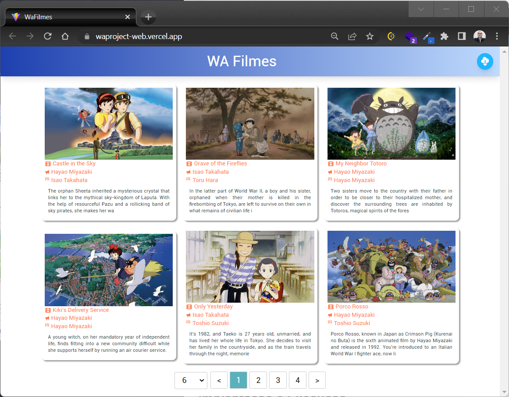

# WA project - Web

Aplicação que consome uma API Rest que prove dados de filmes.

A Aplicação consome uma API Rest através de três end-ponts e disponibiliza informações sobre os filmes cadastrados, possibilitando a navegação por uma barra na parte inferior. Ela também possui, no canto superior direito, um botão solicitar que a API da aplicação busque filmes em outra API externa.

[Acesse aqui](https://waproject-web.vercel.app/)🚀 



## Principais Tech'S

* React JS - Linguagem de Programação
* Typescript - Melhorar a legibilidade, a produtividade e a segurança do código
* React-paginate - Bibliote para realizar a paginação de uma colection
* Tailwindcss - Biblioteca de estilização

## Implantação e Execução

1. [Clonar](#ancora1)
2. [Instalar dependencies](#ancora2)
3. [Inicia a Aplicação ](#ancora3)

<a id="ancora1"></a>
### Clonar

Em uma pasta de preferências, rode o comando:
```
git clone https://github.com/esbnet/waproject-web.git
```
<a id="ancora2"></a>
### Instalar dependencies

Entre na pasta do projeto e instale as dependência com os comandos abaixo:
```
cd waproject-web
yarn install
```

<a id="ancora3"></a>
### Iniciar o servidor 
Para iniciar o projeto basta rodar o comando:
~~~javascript
yarn dev ou npm run dev
~~~